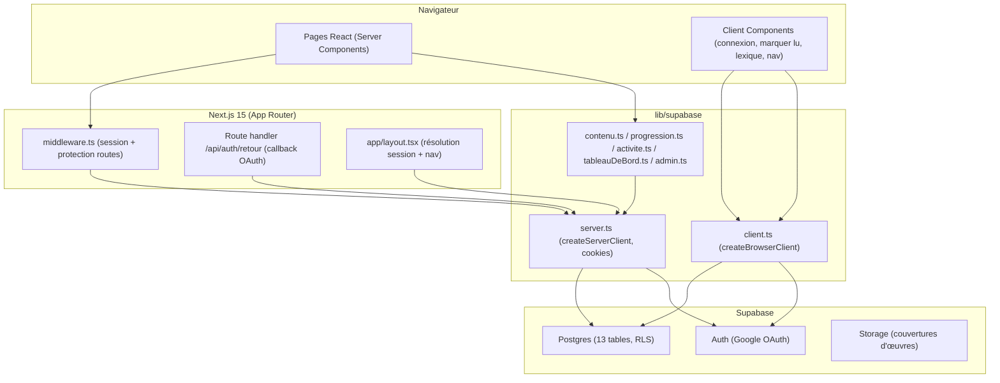
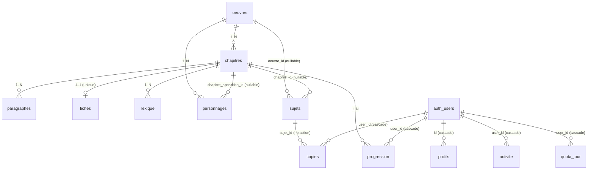

# Project Charter — MADRASTI

> Document d'audit technique et fonctionnel du repository.
> Généré par analyse statique du code et de la documentation existante.
> **Aucune information n'est inventée** : chaque affirmation importante est adossée à
> une preuve dans le repository. Les déductions sont explicitement marquées *(inférence)*.
> Ce qui ne peut pas être déterminé depuis le repository est noté
> *Inconnu / non déterminable depuis le repository*.

---

## 1. Executive Summary

MADRASTI (logo "Medrasti") est une **application web pédagogique bilingue
français/arabe**, destinée à des élèves marocains préparant le baccalauréat
(filière `1bac`, "1ère année bac" affichée dans la barre de navigation).
Le projet donne accès à un programme d'œuvres littéraires au programme
(résumés, chapitres, personnages, lexique, sujets d'exercice) et vise, à terme,
un **outil de correction de copies** (photo → transcription → notation) avec
suivi de progression de lecture et quota quotidien par élève.

Le projet est à un **stade précoce de développement** : les fondations sont
solides (schéma de données, sécurité RLS, authentification, navigation de
lecture, tableau de bord élève), mais plusieurs fonctionnalités clés sont
**amorcées ou non commencées** (dépôt de copie par l'élève, correction
automatique, onglets "œuvre" Personnages/Lexique/Sujets/Biographie, texte
intégral des chapitres).

La pile est moderne et cohérente : **Next.js 15.5 (App Router) + React 19 +
TypeScript + Tailwind CSS v4**, avec **Supabase** (Postgres + Auth + Storage)
comme backend. L'authentification repose sur **Google OAuth** via Supabase Auth.
Le contenu est importé depuis un **fichier Excel** par un script local idempotent.

Le code est remarquablement **documenté en français**, avec un fichier d'état
(`ETAT.md`) qui tient lieu de mémoire de projet à jour.

---

## 2. Project Purpose

**Problème résolu** : offrir à des élèves marocains de 1ère année bac un accès
structuré et bilingue (français/arabe) aux œuvres littéraires du programme,
avec aide à la compréhension (lexique, personnages, résumés), et, à terme, un
correcteur de copies assisté.

**Preuve** : `app/(public)/page.tsx` ("Réussis ton français, chapitre par
chapitre. Résumés, personnages, lexique et sujets pour les œuvres au programme
— et bientôt un correcteur de copie."), `ETAT.md` section 1.

**Deux profils d'utilisateurs** (documentés dans `ETAT.md`, `middleware.ts`,
`types/base-de-donnees.ts` `RoleUtilisateur`) :
- **élève** — accès à son espace (`/tableau-de-bord`, `/activite`,
  `/redaction/nouvelle`) et au contenu public ;
- **admin** — accès à `/administration` (liste des copies), seul rôle autorisé
  à écrire le contenu pédagogique (via RLS).

---

## 3. Functional Overview

État de chaque fonctionnalité identifiée, basé sur le code et `ETAT.md` :

| Fonctionnalité | État | Preuve |
|---|---|---|
| Authentification Google OAuth | ✅ Implémentée | `components/BoutonConnexionGoogle.tsx`, `app/api/auth/retour/route.ts` |
| Création auto du profil (rôle `eleve`) | ✅ Implémentée | `supabase/migrations/20260825120000_creation_profils.sql` (trigger `on_auth_user_created`) |
| Protection des routes élève/admin | ✅ Implémentée | `middleware.ts` |
| Liste des œuvres (`/oeuvres`) | ✅ Implémentée | `app/(public)/oeuvres/page.tsx` |
| Page œuvre (`/oeuvres/[slug]`) — onglet Résumé | ✅ Implémentée | `app/(public)/oeuvres/[slug]/page.tsx`, `OngletResume.tsx` |
| Page œuvre — onglets Personnages/Lexique/Sujets/Biographie | ⚠️ Amorcée (UI présente, contenu "Bientôt disponible") | `app/(public)/oeuvres/[slug]/page.tsx` (branche `else`), `ETAT.md` |
| Page chapitre (`/oeuvres/[slug]/[numero]`) | ✅ Implémentée (résumé bilingue, lexique cliquable, personnages/lieux/sujets, bouton "Marquer comme lu") | `app/(public)/oeuvres/[slug]/[numero]/page.tsx` |
| Texte intégral des chapitres (`paragraphes`) | ⚠️ Amorcée (table + lecteur prêts, contenu non importé) | `TexteChapitre.tsx`, `ETAT.md` |
| Progression de lecture (marquer lu, barre de progression) | ✅ Implémentée | `BoutonMarquerLu.tsx`, `BarreProgression.tsx`, `progression.ts` |
| Journal d'activité | ✅ Implémentée | `activite.ts`, `BlocDernieresActivites.tsx` |
| Tableau de bord élève (4 blocs) | ✅ Implémentée | `app/(eleve)/tableau-de-bord/page.tsx` |
| Historique d'activité (`/activite`) | ✅ Implémentée | `app/(eleve)/activite/page.tsx` |
| Dépôt de copie par l'élève (photo → `copies`) | ❌ Non commencée (table + policies prêtes, aucune UI) | `ETAT.md`, `/redaction/nouvelle` = stub |
| Correction automatique (transcription/notation) | ❌ Non commencée (champs prévus, aucun contexte serveur) | `supabase/migrations/20260826000400_copies.sql`, `ETAT.md` |
| Quota quotidien | ⚠️ Amorcée (table + lecture, valeur codée en dur, pas d'incrément) | `lib/quota.ts`, `quota_jour` |
| Administration — liste des copies | ✅ Implémentée (données vides faute d'UI élève) | `app/(admin)/administration/page.tsx`, `TableauCopies.tsx` |
| Administration — gestion de contenu/rôles | ❌ Non commencée | `ETAT.md` |
| Cours (`cours`) / Ressources | ⚠️ Table en base, aucune UI | `supabase/migrations/20260826000300_cours_sujets.sql`, `/ressources` = stub |
| Import de contenu depuis Excel | ✅ Implémentée (idempotent, 6 feuilles) | `scripts/importer.ts` |

---

## 4. Technical Stack

| Technologie | Rôle | Preuve / Emplacement |
| --- | --- | --- |
| Next.js 15.5.23 | Framework full-stack (App Router, Server Components, middleware, API routes) | `package.json`, `next.config.ts`, `app/` |
| React 19.2.8 | Bibliothèque UI | `package.json` |
| TypeScript 5 | Typage statique | `tsconfig.json`, `types/` |
| Tailwind CSS v4 | Styling (tokens `@theme`, `@import "tailwindcss"`) | `app/globals.css`, `postcss.config.mjs` |
| Supabase (`@supabase/ssr` 0.12.4, `@supabase/supabase-js` 2.112.3) | Backend : Postgres (données), Auth (OAuth), Storage (couvertures) | `package.json`, `lib/supabase/`, `supabase/migrations/` |
| Postgres + RLS | Base de données relationnelle, sécurité au niveau ligne | `supabase/migrations/*.sql` |
| Google OAuth | Authentification | `BoutonConnexionGoogle.tsx`, `middleware.ts` |
| next/font/google (Amiri, DM Sans, Playfair Display, Spectral) | Polices (arabe + latin), auto-hébergées | `app/layout.tsx` |
| ExcelJS 4.4.0 | Lecture du fichier de contenu Excel | `scripts/importer.ts`, `package.json` |
| tsx 4.23 | Exécution du script d'import TypeScript | `package.json` (`npm run importer`) |
| dotenv 17 | Chargement des variables d'env pour le script d'import | `scripts/importer.ts` |
| ESLint 9 + eslint-config-next 15 | Linting | `eslint.config.mjs`, `package.json` |

---

## 5. Repository Structure

```
MADRASTI/
├── app/                      # Routes Next.js (App Router), groupes (public)/(eleve)/(admin)
│   ├── layout.tsx            # Layout racine : polices, nav globale, résolution de session
│   ├── globals.css           # Tokens de design (couleurs, polices, rayons, ombres)
│   ├── (public)/             # Pages publiques : /, /connexion, /oeuvres[/slug[/numero]], /langue, /ressources, /a-propos
│   ├── (eleve)/              # Pages protégées élève : /tableau-de-bord, /activite, /redaction/nouvelle
│   ├── (admin)/              # Pages admin : /administration
│   └── api/auth/retour/      # Callback OAuth (route handler)
├── components/               # 29 composants React (Server par défaut, "use client" au cas par cas)
├── lib/
│   ├── filiere.ts            # Constante FILIERE_ACTUELLE = "1bac"
│   ├── quota.ts              # Constante QUOTA_QUOTIDIEN_MAX = 3
│   ├── lexique.ts            # Normalisation de mots pour le lexique cliquable
│   └── supabase/
│       ├── client.ts         # Client navigateur
│       ├── server.ts         # Client serveur (cookies)
│       ├── contenu.ts        # Lecture du contenu public
│       ├── progression.ts    # Lecture progression
│       ├── activite.ts       # Écriture journal d'activité (déduplication)
│       ├── tableauDeBord.ts  # Agrégations pour /tableau-de-bord et /activite
│       └── admin.ts          # Lecture données réservées admin
├── types/base-de-donnees.ts  # Types TS du schéma, écrits à la main (miroir des migrations)
├── supabase/migrations/      # 11 migrations SQL (schéma + RLS)
├── scripts/importer.ts       # Import Excel → Supabase (service_role)
├── data/                     # Fichier de contenu (xlsx), ignoré par git (sauf .gitkeep)
├── middleware.ts             # Auth + protection des routes (matcher global)
├── .env.example              # Gabarit des variables d'env (3 variables)
├── ETAT.md                   # Mémoire de projet détaillée et à jour
└── AGENTS.md / CLAUDE.md     # Instructions agents (AGENTS.md = bloc auto-généré next dev)
```

**Fichiers de documentation** : `ETAT.md` (mémoire de projet, la référence réelle),
`README.md` (resté au gabarit `create-next-app` par défaut — non spécifique au projet),
`AGENTS.md` (bloc auto-généré par `next dev`, pas une doc projet), `CLAUDE.md`
(simple `@AGENTS.md`), `app/(admin)/README.md` (convention de protection des routes admin).

---

## 6. Architecture

Architecture **server-centric** : les pages sont des **Server Components** qui
lisent Supabase directement au rendu (via `lib/supabase/server.ts`), et ne
descendent vers des **Client Components** ("use client") que pour les
interactions isolées (connexion/déconnexion, "Marquer comme lu", popover de
lexique, surlignage du lien actif).

### Diagramme global



### Flux principal d'une requête (page publique)

```text
Utilisateur (navigateur)
   ↓ GET /oeuvres/boite-a-merveilles
middleware.ts (rafraîchit la session Supabase à chaque requête)
   ↓
app/(public)/oeuvres/[slug]/page.tsx (Server Component)
   ↓
lib/supabase/contenu.ts → lib/supabase/server.ts (createServerClient, cookies)
   ↓
Supabase PostgREST (requêtes soumises à RLS)
   ↓
Postgres (tables oeuvres / chapitres / fiches / lexique / personnages / sujets / progression)
   ↓
HTML rendu serveur → réponse
```

### Flux d'authentification

```text
Clique "Se connecter avec Google"
   ↓
Client: supabase.auth.signInWithOAuth({ provider: "google", redirectTo: /api/auth/retour })
   ↓
Écran de consentement Google
   ↓
Supabase Auth (échange + session)
   ↓
GET /api/auth/retour?code=... → exchangeCodeForSession(code) → cookies posés
   ↓
Redirection /tableau-de-bord (protégé par middleware)
```

*(inférence)* La requête au serveur Supabase passe par l'API REST PostgREST
générée automatiquement — aucune API applicative "métier" n'est écrite à la main,
à l'exception du route handler `app/api/auth/retour/route.ts`.

---

## 7. Main Components

### Backend / données

| Composant | Responsabilité | Emplacement | Dépendances | Importance |
|---|---|---|---|---|
| `creerClientServeur()` | Client Supabase serveur, lit/écrit les cookies, à recréer par requête | `lib/supabase/server.ts` | `@supabase/ssr`, `next/headers` | Critique |
| `creerClientNavigateur()` | Client Supabase navigateur | `lib/supabase/client.ts` | `@supabase/ssr` | Critique |
| Fonctions `contenu.ts` | Lecture du contenu public (œuvres, chapitres, fiches, paragraphes, lexique, personnages, sujets) | `lib/supabase/contenu.ts` | `server.ts`, `types/` | Critique |
| `progression.ts` | Lecture progression par œuvre/chapitre (renvoie "vide" si non connecté) | `lib/supabase/progression.ts` | `server.ts` | Élevée |
| `activite.ts` | Écriture journal d'activité, non bloquante, déduplication 60 s | `lib/supabase/activite.ts` | `server.ts` | Moyenne |
| `tableauDeBord.ts` | Agrégations multi-tables (activités résolues en liens, progression par œuvre, stats copies, quota) | `lib/supabase/tableauDeBord.ts` | `contenu.ts`, `filiere.ts`, `quota.ts` | Élevée |
| `admin.ts` | Lecture des copies pour l'espace admin (jointure manuelle sur `profils`) | `lib/supabase/admin.ts` | `server.ts` | Moyenne |
| `middleware.ts` | Rafraîchit la session + protège `/tableau-de-bord`, `/redaction`, `/activite` (connecté) et `/administration` (rôle admin) | `middleware.ts` | `@supabase/ssr` | Critique |
| `scripts/importer.ts` | Import idempotent Excel → Supabase (service_role) | `scripts/importer.ts` | `exceljs`, `dotenv`, `@supabase/supabase-js` | Élevée |
| Migrations SQL | Schéma + RLS (13 tables, 1 fonction `est_admin()`, 1 trigger) | `supabase/migrations/` | — | Critique |

### Frontend (composants notables)

| Composant | Responsabilité | Client/Server | Importance |
|---|---|---|---|
| `BarreNavigation` | Nav globale (74px, logo, liens, état connexion), menu mobile `<details>` natif | Server | Élevée |
| `LiensNavigation` | Liens de nav avec surlignage du lien actif | **Client** (`usePathname`) | Moyenne |
| `BoutonConnexionGoogle` / `BoutonDeconnexion` | Connexion/déconnexion OAuth | **Client** | Élevée |
| `BanniereOeuvre` | Bannière d'œuvre (résumé bilingue, boutons conditionnés au `mode`) | Server | Élevée |
| `OngletsOeuvre` / `OngletsChapitre` | Barre d'onglets (navigation par query param `?onglet=`) | Server | Moyenne |
| `SommaireChapitres` | Liste des chapitres (badge lu / numéroté) | Server | Moyenne |
| `BoutonMarquerLu` | Toggle "Marquer comme lu" avec mise à jour optimiste | **Client** | Élevée |
| `MotLexique` | Mot cliquable → définition (popover desktop / feuille mobile) | **Client** | Moyenne |
| `CarteBilingue` | Paire de cartes résumé fr/ar | Server | Moyenne |
| `FicheChapitre` / `TexteChapitre` / `LexiqueChapitre` / `PersonnagesChapitre` / `LieuxChapitre` / `SujetsChapitre` | Contenus du chapitre | Server | Moyenne |
| `BlocReprendre` / `BlocRedaction` / `BlocProgression` / `BlocDernieresActivites` | Blocs du tableau de bord (avec états "invitation") | Server | Moyenne |
| `TableauCopies` | Liste des copies (admin) | Server | Faible |
| `icones.tsx` | Jeu d'icônes SVG maison | Server | Moyenne |
| `IllustrationEnfantBoite` | Illustration SVG originale du panneau de couverture | Server | Faible |

---

## 8. Data Architecture

### Base de données : PostgreSQL via Supabase

**13 tables** (schéma dans `supabase/migrations/`), réparties en deux familles :

**Contenu pédagogique** (lecture publique `using (true)`, écriture admin via `public.est_admin()`) :
- `oeuvres` — slug, titre_fr/ar, auteur, filiere, mode (`texte_integral`|`accompagnement`), essentiel_fr/ar, couverture_url, biographie_fr/ar
- `chapitres` — oeuvre_id, numero, titre_fr/ar, resume_court, lieux (jsonb), citation_reference, statut
- `paragraphes` — chapitre_id, ordre, texte_fr/ar (texte intégral, unique `(chapitre_id, ordre)`)
- `fiches` — chapitre_id (unique), resume_fr/ar, themes (jsonb {principal, secondaires}), points_cles_fr/ar
- `lexique` — chapitre_id, mot, sens_ar, nature, note (unique `(chapitre_id, mot)`)
- `personnages` — oeuvre_id, nom, nom_ar, role, description_fr, chapitre_apparition_id
- `cours` — slug, titre, categorie, contenu_mdx, filiere, ordre
- `sujets` — oeuvre_id (nullable), chapitre_id (nullable), titre, consigne, type

**Données élève** (chacun ne voit/écrit que les siennes, `auth.uid() = user_id`) :
- `profils` — id (PK = auth.users), email, nom_complet, role (`eleve`|`admin`), date_creation (remplie par trigger)
- `copies` — user_id, sujet_id, image_url, transcription, notes (forme/fond/total), erreurs/points_forts/axes (jsonb), commentaire, cout_tokens
- `progression` — PK composite `(user_id, chapitre_id)`, lu, termine_le
- `activite` — user_id, type, ressource_id, ressource_titre (append-only)
- `quota_jour` — PK composite `(user_id, date)`, corrections_utilisees

### Relations clés



**Note (inférence + preuve dans `admin.ts`)** : `copies.user_id` référence `auth.users`,
pas `public.profils`. Il n'y a donc **pas de relation directe** entre `copies` et
`profils` ; l'identité de l'élève est résolue par une seconde requête manuelle.

### Migrations

11 fichiers dans `supabase/migrations/`, nommés par horodatage
(`YYYYMMDDHHMMSS_description.sql`). **Aucune CLI Supabase n'est liée au dépôt** :
les migrations doivent être appliquées **manuellement** dans l'éditeur SQL du
dashboard Supabase (documenté dans `ETAT.md` — la migration
`20260829000000_lecture_admin_profils.sql` n'était pas appliquée à la dernière
mise à jour).

### Validation / transactions

- La validation métier repose principalement sur des **contraintes SQL** :
  `check` (`role`, `mode`), `unique` (pour les upserts idempotents de l'import),
  `not null`, clés étrangères avec comportements réfléchis (`on delete cascade` vs
  `set null` vs `no action`).
- **Aucune transaction explicite** dans le code applicatif (les opérations sont
  unitaires ; l'import fait des upserts séquentiels, pas une transaction globale).
- **Pas de couche ORM/repository** : accès direct via le client Supabase
  (`supabase.from("table")...`), typé à la main.

### Cache

**Aucun mécanisme de cache explicite** *(inférence)*. Le rendu des Server
Components est dynamique (session résolue dans `app/layout.tsx`), ce qui désactive
le rendu statique. Aucun usage de `unstable_cache`, `revalidate`, ni de cache
Redis/CDN visible.

---

## 9. API / Interfaces

### Route handler applicative

| Endpoint | Méthode | Rôle | Auth |
|---|---|---|---|
| `/api/auth/retour` | GET | Callback OAuth : échange `code` → session, redirection | Publique (échange du code) |

### "API" de données (PostgREST implicite)

Il n'existe **pas d'API REST métier écrite à la main**. Les données sont lues/
écrites directement depuis les Server/Client Components via le client Supabase,
qui dialogue avec l'API PostgREST générée par Supabase. Les contrats sont donc
définis par le **schéma SQL + les policies RLS**, et les types TypeScript
(`types/base-de-donnees.ts`) en sont le miroir applicatif.

### Conventions de réponses / erreurs

- Erreurs de lecture Supabase : levées (`throw error`) dans les fonctions
  `lib/supabase/*`, ce qui provoque l'`error.tsx` Next.js (ou une 500) — pas de
  gestion d'erreur "gracieuse" unifiée.
- Erreurs d'écriture d'activité : **absorbées** (console.error, non bloquantes) —
  `lib/supabase/activite.ts`.
- Écriture de progression : mise à jour optimiste avec **rollback** en cas
  d'échec — `components/BoutonMarquerLu.tsx`.
- 404 : `notFound()` sur œuvre/chapitre introuvable ou numéro invalide.

---

## 10. User / Business Flows

### Flux élève — lecture et progression

```text
Élève connecté
  → /oeuvres (grille des œuvres, filière "1bac")
  → /oeuvres/[slug] (bannière + résumé + sommaire)
  → /oeuvres/[slug]/[numero] (résumé bilingue, lexique cliquable, onglets)
  → bouton "Marquer comme lu" (écriture optimiste dans `progression`)
  → consultation journalisée dans `activite` (dédupliquée sur 60 s)
  → /tableau-de-bord (bloc Reprendre/Progression reflètent l'état)
```

### Flux admin — consultation des copies

```text
Admin connecté (profils.role = 'admin')
  → middleware vérifie le rôle (requête RLS)
  → /administration liste les copies (TableauCopies)
  → (aucune copie à afficher tant que l'UI élève de dépôt n'existe pas)
```

### Flux d'import de contenu (opérateur / développeur)

```text
Opérateur
  → met à jour data/contenu-plateforme-bac.xlsx (6 feuilles)
  → npm run importer (local, clé service_role)
  → upserts idempotents sur oeuvres/chapitres/fiches/lexique/personnages/sujets
  → résumé des compteurs + erreurs éventuelles
```

### Workflows critiques vs secondaires

- **Critique** : lecture des œuvres/chapitres (cœur du produit), authentification,
  protection des routes, RLS.
- **Secondaire / à venir** : correction de copie (photo → notation), quota, cours.

---

## 11. External Integrations

| Service externe | Usage | Preuve |
|---|---|---|
| Supabase (Postgres + Auth + Storage) | Base de données, authentification, stockage des couvertures | `lib/supabase/`, `next.config.ts` (`*.supabase.co` pour `next/image`) |
| Google OAuth | Connexion des utilisateurs | `BoutonConnexionGoogle.tsx` |
| Google Fonts (via `next/font/google`) | Polices (auto-hébergées au build) | `app/layout.tsx` |

Aucune autre intégration (paiement, e-mail, analytics, IA) n'est visible dans le
code, bien que le schéma anticipe un correcteur de copie avec `cout_tokens`
*(inférence)* — aucun appel à un LLM n'est présent.

---

## 12. Development Workflow

### Installation / lancement

```bash
npm install
# configurer .env.local (à partir de .env.example)
npm run dev        # serveur de dev Next.js
```

### Scripts (`package.json`)

| Script | Commande | Rôle |
|---|---|---|
| `dev` | `next dev` | Serveur de développement |
| `build` | `next build` | Build de production |
| `start` | `next start` | Serveur de production |
| `lint` | `eslint` | Linting |
| `importer` | `tsx scripts/importer.ts` | Import du contenu Excel vers Supabase |

### Variables d'environnement (`.env.example`)

| Variable | Usage | Exposition |
|---|---|---|
| `NEXT_PUBLIC_SUPABASE_URL` | Client + serveur + script import | Publique (navigateur) |
| `NEXT_PUBLIC_SUPABASE_ANON_KEY` | Client + serveur | Publique (navigateur) |
| `SUPABASE_SERVICE_ROLE_KEY` | Script import uniquement | **Jamais côté navigateur** |

### Spécificités / pièges connus (documentés dans `ETAT.md`)

- ⚠️ Le serveur de dev peut laisser des processus `node.exe` **orphelins** à
  chaque redémarrage (port incrémenté : 3000, 3001…), saturant la RAM. Les tuer
  explicitement (`taskkill //F //PID <pid>`).
- ⚠️ Les migrations doivent être appliquées manuellement dans le dashboard
  Supabase (pas de CLI liée).

---

## 13. Testing Strategy

**Aucun test automatisé.** Preuves :
- aucun fichier `*.test.*` / `*.spec.*` (recherche glob : 0 résultat) ;
- aucun script `test` dans `package.json` ;
- aucun runner (jest/vitest/playwright) dans les dépendances ;
- `ETAT.md` le confirme explicitement ("Aucun test automatisé").

**Seule validation constatée** : un **test manuel jetable** de l'isolation RLS de
`progression` (décrit dans `ETAT.md`, section 4, non committé) — deux comptes
élève créés puis supprimés, vérification des trois angles (lecture, modification,
usurpation à l'insertion). C'est de la vérification manuelle, pas de la
régression automatisée.

**Zones critiques non testées** : toute la logique métier (`lib/supabase/*`,
`lib/lexique.ts`, le script d'import, le middleware), les composants, et la
sécurité RLS (au-delà du test ponctuel décrit).

---

## 14. Deployment & Infrastructure

- **CI/CD** : **aucun fichier** `.github/`, pas de pipeline visible.
- **Docker** : aucun `Dockerfile` ni `docker-compose`.
- **Plateforme** : le `README.md` (gabarit) mentionne Vercel, et `.gitignore`
  contient `.vercel` — mais **aucune configuration de déploiement réelle n'est
  committée**. *(inférence)* Le déploiement est probablement prévu sur Vercel
  (application Next.js) + Supabase (backend managé), mais rien ne le confirme
  dans le repository.
- **Environnements** : un seul environnement visible (`master`, `.env.local`).
  *Inconnu / non déterminable depuis le repository* : environnement de production,
  URLs réelles, SLA.
- **Secrets** : gérés via `.env.local` (ignoré par git), gabarit dans
  `.env.example`. Aucun secret committé.
- **Monitoring / observabilité** : **aucune** solution visible (pas de Sentry,
  pas de logs structurés, seuls des `console.error`/`console.log` ad hoc).

---

## 15. Security Review

> Revue **non exhaustive**, limitée aux éléments observables dans le code. Elle ne
> remplace pas un audit de sécurité réel.

### Points corrects observés (preuves dans le code)

1. **RLS activée sur les 13 tables**, sans exception (`supabase/migrations/`).
2. **Vérification du rôle admin côté serveur** (`middleware.ts` + requête RLS),
   jamais côté client.
3. **Clé `service_role` cantonnée** à `scripts/importer.ts` — jamais référencée
   dans `app/`, `components/` ou `lib/`.
4. **Clés `NEXT_PUBLIC_*`** exposées par design (clé anon), sécurité reposant sur
   RLS — modèle correct Supabase (documenté dans `.env.example`).
5. **`.env.local` et `data/*` ignorés par git** (`.gitignore`).
6. **Isolation RLS de `progression` testée concrètement** (manuel, décrit dans
   `ETAT.md`).
7. **Pas de policy d'auto-promotion** : un élève ne peut pas modifier son rôle
   (aucune policy UPDATE sur `profils`) — garantie de sécurité implicite.
8. **`quota_jour` sans policy d'écriture élève** : évite la remise à zéro du
   quota par l'élève (anticipé dans les commentaires de migration).

### Points de vigilance

1. **`copies` et `quota_jour`** n'ont pas encore de contexte serveur qui les
   écrit ; le jour de l'implémentation, l'incrément du quota et le remplissage
   des notes devront passer par `service_role` (ou une fonction `security definer`
   dédiée), pas par une policy ouverte élève.
2. **Fonction `est_admin()` non `security definer`** : elle repose sur la policy
   "les utilisateurs voient leur propre profil". Correct aujourd'hui, mais fragile
   si cette policy venait à changer (couplage implicite).
3. **Pas de rate limiting / protection anti-abus** visible sur les écritures
   client directes (`progression` upsert, connexion).
4. **`console.error`** de `activite.ts` peut loguer des données sensibles en
   production *(inférence)* (messages d'erreur Supabase).
5. **Aucune gestion centralisée des erreurs** : les erreurs Supabase lèvent des
   exceptions qui remontent jusqu'au rendu (fuite possible d'info technique).

### Dépendances

- Versions récentes et épinglées avec `^` (Next 15.5.23, React 19.2.8). Pas
  d'outil de scan de vulnérabilités (`npm audit`) visible dans les scripts.
- `next.config.ts` autorise `images.remotePatterns` sur `*.supabase.co` — motif
  large mais volontaire (documenté).

---

## 16. Architecture Assessment

### Forces

1. **Sécurité RLS exemplaire et cohérente** : un modèle de policy uniforme et
   bien pensé, documenté au cas par cas dans les migrations.
2. **Séparation claire des responsabilités** dans `lib/supabase/` : lecture de
   contenu / progression / activité / agrégations / admin, chacune dans son
   fichier, avec des frontières nettes.
3. **Architecture server-centric idiomatique Next.js 15** : Server Components par
   défaut, Client Components limités aux interactions, `Promise.all` pour
   paralléliser les lectures.
4. **Anti-N+1 soigné** : `tableauDeBord.ts` regroupe les résolutions par `in()`
   (documenté explicitement).
5. **Documentation interne exceptionnelle** : commentaires français qui
   expliquent le "pourquoi", et `ETAT.md` qui trace l'historique et les décisions.
6. **Design system centralisé** : tokens dans `globals.css`, aucune valeur brute.
7. **Prudence produit** : refus de fabriquer du contenu (chapitres fictifs,
   années de publication absentes) — voir `ETAT.md`.

### Faiblesses

1. **Aucun test automatisé** — le risque de régression est totalement ouvert.
2. **Typage manuel du schéma** (`types/base-de-donnees.ts`) : risque de
   **désynchronisation** avec le schéma réel (pas de CLI `supabase gen types`
   liée). Le code le documente lui-même comme un état transitoire.
3. **Filière et quota codés en dur** (`lib/filiere.ts`, `lib/quota.ts`) : décisions
   métier non prises, valeur de quota **inventée** (reconnue dans `ETAT.md`).
4. **Liste manuelle des routes protégées** dans `middleware.ts`
   (`CHEMINS_PROTEGES`/`CHEMINS_ADMIN`) : chaque nouvelle route doit être ajoutée
   à la main — risque d'oubli.
5. **Gestion des erreurs non uniforme** : tantôt `throw`, tantôt absorbée, pas de
   `error.tsx` ni de politique d'erreur claire.
6. **README.md** non spécifique au projet (gabarit `create-next-app`).

---

## 17. Technical Debt

| Priorité | Problème | Impact | Complexité | Recommandation |
|---|---|---|---|---|
| **P1** | Aucun test automatisé | Risque de régression total, surtout sur la logique `lib/` et la RLS | Moyenne | Mettre en place Vitest + tests unitaires sur `lib/` et le middleware ; tests d'intégration RLS |
| **P1** | Typage du schéma maintenu à la main | Désynchronisation types/schéma → bugs silencieux | Faible | Lier la CLI Supabase et régénérer `types/base-de-donnees.ts` (`supabase gen types`) |
| **P1** | Pas de CI/CD | Aucune garde-fou avant merge (lint/test/build) | Faible | Pipeline GitHub Actions/Vercel : lint + build + tests |
| **P2** | Filière codée en dur (`lib/filiere.ts`) | Impossibilité de servir plusieurs filières | Moyenne | Ajouter `profils.filiere` + dériver le filtrage |
| **P2** | Quota codé en dur (3, valeur inventée) | Règle métier non validée | Faible | Confirmer la valeur produit ; externaliser en config |
| **P2** | Liste manuelle des routes protégées (`middleware.ts`) | Risque d'oubli de protection sur les nouvelles routes | Faible | Centraliser / documenter le processus (déjà fait), ou basculer sur une convention |
| **P2** | Migrations appliquées manuellement (pas de CLI liée) | Risque de drift entre dépôt et base de production | Moyenne | Lier la CLI Supabase, gérer les migrations en version |
| **P3** | README.md générique | Onboarding dégradé pour un nouveau dev | Faible | Rédiger un README projet |
| **P3** | Gestion d'erreur non uniforme (`throw` vs absorption) | Comportements incohérents | Moyenne | Définir une politique d'erreur (error.tsx, boundaries) |
| **P3** | `est_admin()` non `security definer` (couplage implicite à une policy) | Fragilité si la policy `profils` change | Faible | Documenter le couplage ou isoler |

---

## 18. Risks

### Risques produit / métier

- **Le cœur de valeur annoncé** (correcteur de copie IA) **n'existe pas encore** :
  le produit est aujourd'hui un lecteur d'œuvres. Risque d'écart entre la vision
  et le livré actuel.
- **Contenu dépendant d'un fichier Excel** (`data/contenu-plateforme-bac.xlsx`,
  ignoré par git) : le contenu réel n'est pas versionné ; perte/altération du
  fichier = perte du contenu.

### Risques techniques

- **Aucun test** : toute évolution peut casser silencieusement la logique ou la RLS.
- **Désynchronisation types/schéma** (typage manuel) : erreurs de type non
  détectées jusqu'au runtime.
- **Écritures client directes** (`progression` upsert, connexion) sans rate
  limiting visible.
- **Absence de monitoring** : les erreurs de production seraient invisibles.
- **Absence de pipeline** : risque de déployer du code non linté/non buildé.

### Risques de sécurité *(inférence, non exhaustif)*

- Le jour où `copies`/`quota_jour` seront écrits, une implémentation naïve (policy
  élève ouverte) serait une faille — déjà anticipé dans les migrations, à honorer.
- Aucun audit de dépendances automatisé.

### Risques de scalabilité *(inférence)*

- Les pages font des requêtes Supabase à chaque rendu (dynamique) ; pas de cache.
  Sous forte charge, coût et latence augmenteront linéairement.
- `NOMBRE_MAX_ACTIVITES = 200` sans pagination (`/activite`) : acceptable à ce
  stade, à revoir si l'historique grandit.

---

## 19. Opportunities

1. **Correcteur de copie** : la table `copies` et le quota sont déjà prêts — c'est
   la plus grosse opportunité de valeur, il ne manque que l'UI élève et le
   contexte serveur de correction.
2. **Texte intégral** : le script d'import est prêt à lire une feuille
   "Paragraphes" dès qu'elle existe — déblocage rapide du mode `texte_integral`.
3. **Onglets œuvre** (Personnages/Lexique/Sujets/Biographie) : les tables et
   colonnes existent déjà, seul le branchement UI manque.
4. **Cours / Ressources** : la table `cours` (avec `contenu_mdx`) est prête, aucune
   UI — opportunité de contenu additionnel.
5. **Multi-filière** : en dérivant `profils.filiere`, le produit s'ouvre aux autres
   niveaux (2bac, etc.).
6. **Mise en place de tests** : le code `lib/` est bien isolé et documenté, très
   testable.

---

## 20. Brainstorming

> Idées à valider — **hypothèses et recommandations**, non des faits.

### Faits (rappel)

- Le schéma anticipe déjà correction + quota (`copies`, `quota_jour`).
- Le script d'import est prêt pour `paragraphes`, `cours`, couverture/biographie.
- Aucun test, aucun CI/CD.

### Observations

- La progression de lecture est étonnamment aboutie pour un stade précoce.
- Le souci du détail (optimistic update, déduplication, anti-N+1, "aucun bloc
  vide") est constant — signe d'une exécution disciplinée.

### Hypothèses *(à confirmer avec l'équipe)*

- La correction de copie serait réalisée via un LLM (indice : `cout_tokens`,
  `transcription`, `commentaire`), mais aucun appel n'est codé.
- Le déploiement viserait Vercel + Supabase (indices faibles : gabarit README,
  `.vercel` dans `.gitignore`).
- Le quota "3 corrections/jour" est un placeholder, pas une décision produit
  (explicite dans `ETAT.md`).

### Recommandations (hors périmètre de cet audit — à valider)

1. **Prioriser les tests** sur la couche `lib/` (fort ROI, code isolé).
2. **Lier la CLI Supabase** pour le typage et les migrations.
3. **Mettre en place un CI** minimal (lint + build + tests) avant toute
   accélération du développement.
4. **Brancher les onglets œuvre** (données déjà en base) — quick win de contenu.
5. **Ajouter la feuille "Paragraphes"** à l'Excel pour débloquer le texte intégral.

---

## 21. Recommended Roadmap

### Phase 0 — Compréhension / sécurisation

| Priorité | Objectif | Justification | Impact | Complexité | Dépendances |
|---|---|---|---|---|---|
| P1 | Appliquer la migration `20260829000000_lecture_admin_profils.sql` | Nécessaire avant de tester `/administration` avec de vraies données | Moyen | Faible | Accès dashboard Supabase |
| P1 | Ajouter un CI minimal (lint + build) | Bloque la régression technique avant merge | Élevé | Faible | — |
| P1 | Mettre en place un socle de tests (`lib/` + middleware) | Couvre la logique critique actuellement non testée | Élevé | Moyenne | Choix du runner |
| P2 | Confirmer la vraie valeur de `QUOTA_QUOTIDIEN_MAX` | Règle métier inventée à valider | Moyen | Faible | Décision produit |

### Phase 1 — Quick wins

| Priorité | Objectif | Justification | Impact | Complexité | Dépendances |
|---|---|---|---|---|---|
| P2 | Brancher les onglets Personnages/Lexique/Sujets/Biographie de `/oeuvres/[slug]` | Données déjà en base, seuls les composants manquent | Élevé | Faible | — |
| P2 | Rédiger un README projet | Onboarding | Moyen | Faible | — |
| P3 | Lier la CLI Supabase + régénérer les types | Élimine le risque de drift types/schéma | Élevé | Faible | Accès projet Supabase |

### Phase 2 — Stabilisation

| Priorité | Objectif | Justification | Impact | Complexité | Dépendances |
|---|---|---|---|---|---|
| P1 | Étendre la couverture de tests (RLS, importer.ts, composants) | Fiabilise le cœur du produit | Élevé | Moyenne | Phase 0 tests |
| P2 | Ajouter `profils.filiere` et dériver le filtrage | Débloque le multi-filière, supprime le hard-code | Élevé | Moyenne | Décision produit |
| P2 | Politique d'erreur unifiée (error.tsx, boundaries) | Comportement cohérent en cas d'erreur | Moyen | Moyenne | — |
| P2 | Gérer les migrations via CLI (versionnement) | Réduit le drift base/dépôt | Moyen | Faible | Phase 1 CLI |
| P3 | Monitoring/observabilité de base (logs, erreurs) | Visibilité production | Moyen | Moyenne | Choix d'outil |

### Phase 3 — Évolution

| Priorité | Objectif | Justification | Impact | Complexité | Dépendances |
|---|---|---|---|---|---|
| P1 | Construire l'UI élève de dépôt de copie (photo → `copies`) | Seule pièce manquante pour alimenter `/administration` et le bloc Rédaction | Très élevé | Élevée | Stockage Storage |
| P1 | Contexte serveur de correction (remplir notes + incrément quota via service_role) | Cœur de la valeur "correcteur" | Très élevé | Élevée | UI dépôt, choix LLM |
| P2 | Ajouter la feuille "Paragraphes" à l'Excel + import | Débloque le texte intégral | Élevé | Faible | Contenu éditorial |
| P2 | UI Ressources/Cours (table `cours` prête) | Contenu additionnel | Moyen | Moyenne | Contenu éditorial |

### Phase 4 — Long terme

| Priorité | Objectif | Justification | Impact | Complexité | Dépendances |
|---|---|---|---|---|---|
| P2 | Cache/optimisation du rendu (ISR/revalidation) si le trafic le justifie | Performance/coût | Moyen | Élevée | Monitoring en place |
| P3 | Gestion des rôles (policy UPDATE admin, avec garde anti-rétrogradation) | Administration complète | Moyen | Moyenne | Décision sécurité |
| P3 | Pagination de `/activite` | Scalabilité de l'historique | Faible | Faible | Volume réel d'usage |
| P3 | Vraie gestion de contenu admin (œuvres/chapitres) | Éliminer la dépendance au script Excel | Moyen | Élevée | Besoin éditorial confirmé |

---

## 22. Open Questions

> Informations non déterminables depuis le repository. Ne pas combler par des
> suppositions.

1. **Environnement de production** : existe-t-il ? Sur quelle plateforme
   (Vercel ? ailleurs) ? Quelles URLs ?
2. **SLA / exigences de disponibilité** : inconnus.
3. **Volume réel d'utilisateurs** : inconnu — conditionne la nécessité du cache.
4. **Contraintes de performance** : inconnues (latence attendue, budget).
5. **Décision produit sur le quota** : la valeur `3` est reconnue comme inventée
   (`ETAT.md`) — quelle est la vraie règle ?
6. **Périmètre du correcteur** : LLM utilisé ? quel fournisseur ? quel coût
   (`cout_tokens` anticipe une facturation) ? transcription manuelle ou OCR ?
7. **Filières à supporter** : uniquement `1bac`, ou extension prévue ?
8. **Raisons historiques** de l'absence de CLI Supabase liée et de l'application
   manuelle des migrations.
9. **Contenu éditorial** : qui rédige/vérifie le contenu arabe (la version arabe
   du résumé de *La Boîte à Merveilles* n'a pas été relue par un locuteur — `ETAT.md`) ?
10. **Stratégie de monétisation** (le quota "gratuit" suggère une offre payante) :
    inconnue.
11. **Existence d'autres environnements** (staging, production) et de leurs
    configurations Supabase.
12. **Pourquoi `sujets.oeuvre_id` nullable et le choix `on delete set null`** sont
    documentés, mais les cas d'usage réels de sujets "hors œuvre" ne sont pas
    visibles dans les données.

---

## 23. Agent Onboarding Guide

> Destiné aux futurs développeurs / agents IA rejoignant le projet.

### Fichiers à lire en premier

1. **`ETAT.md`** — LA référence projet : état, inventaire, manques, sécurité,
   prochaines étapes. À lire intégralement.
2. **`app/layout.tsx`** — polices + résolution de session + nav globale.
3. **`middleware.ts`** — modèle de protection des routes.
4. **`lib/supabase/server.ts`** et **`lib/supabase/client.ts`** — les deux clients.
5. **`lib/supabase/contenu.ts`** — lecture du contenu (modèle de référence).
6. **`supabase/migrations/`** — le schéma et les policies (lire dans l'ordre).
7. **`app/globals.css`** — les tokens de design.
8. **`types/base-de-donnees.ts`** — le miroir typé du schéma.

### Modules importants

- `lib/supabase/` — toute la logique d'accès aux données, répartie par domaine.
- `app/` — les routes, organisées en groupes `(public)`, `(eleve)`, `(admin)`.
- `components/` — 29 composants, Server par défaut.

### Conventions à respecter

- **Langue du code** : commentaires et identifiants en **français** (ex.
  `creerClientServeur`, `recupererOeuvresParFiliere`). Respecter cette convention.
- **Server Components par défaut** ; `"use client"` uniquement pour l'interactivité
  (connexion/déconnexion, marquer lu, popover, `usePathname`).
- **Design tokens uniquement** : pas de valeurs brutes (`bg-[#fff]`) — passer par
  `globals.css`.
- **Pas de requête `getUser()` redondante** : passer `userId` en paramètre
  (voir les commentaires de `progression.ts`).
- **Nouvelle route protégée** : ajouter son chemin à `CHEMINS_PROTEGES` ou
  `CHEMINS_ADMIN` dans `middleware.ts` (les groupes de routes n'apparaissent pas
  dans l'URL).
- **Écriture de contenu** : uniquement via `scripts/importer.ts` (service_role),
  jamais depuis l'app.
- **`supabase/`** : toute modification de schéma se fait par une **nouvelle
  migration** SQL (nommée par horodatage), jamais en écrasant les existantes.

### Zones sensibles

- **`middleware.ts`** — la protection des routes ; toute erreur ici expose ou
  bloque des utilisateurs.
- **Migrations RLS** — toute policy touchant `profils`/`est_admin()` a des
  implications de sécurité.
- **`scripts/importer.ts`** — manipule la clé `service_role` ; ne jamais
  l'introduire dans `app/`, `components/` ou `lib/`.
- **`lib/lexique.ts`** — normalisation fragile (limites documentées : pas
  d'expressions multi-mots, pas d'accords).
- **`BoutonMarquerLu.tsx`** — écriture optimiste : préserver le rollback.

### Commandes utiles

```bash
npm run dev          # serveur de dev
npm run build        # build
npm run lint         # lint
npm run importer     # import du contenu Excel (local, service_role)
```

### Choses à éviter

- Ne **pas** coder d'écriture côté élève sur `copies`/`quota_jour` sans contexte
  serveur `service_role` (anticipé dans les migrations).
- Ne **pas** fabriquer de contenu fictif (chapitres, dates, titres) — le projet
  refuse explicitement cela.
- Ne **pas** installer Playwright directement dans le `node_modules` du projet
  pendant que `next dev` tourne (a corrompu le cache webpack — voir `ETAT.md`).
- Ne **pas** modifier les migrations déjà appliquées en production.
- Ne **pas** ignorer l'avertissement "Next.js différent" de `AGENTS.md`.

### Points nécessitant une attention particulière

- **Processus `node.exe` orphelins** du serveur de dev (voir `ETAT.md`).
- **Migrations manuelles** : vérifier l'état d'application dans le dashboard
  Supabase avant de tester.
- **Visiteur non connecté** sur les pages publiques : `user === null` est un cas
  **normal** (pas une erreur) — toutes les fonctions `lib/supabase/*` le gèrent
  en renvoyant "vide" sans requête.

---

## 24. Final Assessment

### Maturité estimée

**Pré-alpha / MVP partiel.** Les fondations (schéma, sécurité, authentification,
navigation de lecture, tableau de bord) sont solides et de bonne qualité, mais le
cœur de la valeur annoncée (correcteur de copie) n'est pas construit, et il
n'existe **ni tests ni CI/CD**.

### État général

Code **propre, discipliné et remarquablement documenté**, avec une architecture
cohérente et une sécurité RLS exemplaire. Le principal frein est l'**absence
totale de tests** et l'**absence de pipeline**, qui rendent toute évolution
risquée malgré la qualité du code.

### Principales forces

1. Sécurité RLS uniforme et bien pensée, documentée au cas par cas.
2. Séparation claire des responsabilités dans `lib/supabase/`.
3. Documentation interne exceptionnelle (`ETAT.md` + commentaires "pourquoi").
4. Architecture server-centric idiomatique, anti-N+1, optimistic updates.
5. Design system centralisé via tokens.

### Principaux problèmes

1. Aucun test automatisé (P1).
2. Aucun CI/CD (P1).
3. Typage du schéma maintenu à la main → risque de drift (P1).
4. Filière et quota codés en dur, quota inventé (P2).
5. Cœur de valeur (correcteur) non implémenté (P1 produit).

### 5 priorités recommandées

1. **Mettre en place les tests** (socle sur `lib/` + middleware) — P1.
2. **Ajouter un CI** (lint + build + tests) — P1.
3. **Lier la CLI Supabase** (typage généré + migrations versionnées) — P2.
4. **Construire le dépôt de copie élève** (photo → `copies`) — P1 produit.
5. **Brancher les onglets œuvre** (données déjà en base) — P2 quick win.

### Niveau de confiance de l'analyse

**Élevé.** L'analyse s'appuie sur la lecture directe de l'ensemble du code source
(`app/`, `components/`, `lib/`, `types/`, `scripts/`), des 11 migrations SQL, de
la configuration, et d'une documentation projet interne (`ETAT.md`) détaillée et
cohérente avec le code. Les seules zones d'incertitude sont celles marquées
*Inconnu* (environnement de production, volumes, décisions produit) — qui
nécessitent une réponse humaine et ne sont pas déductibles du repository.
